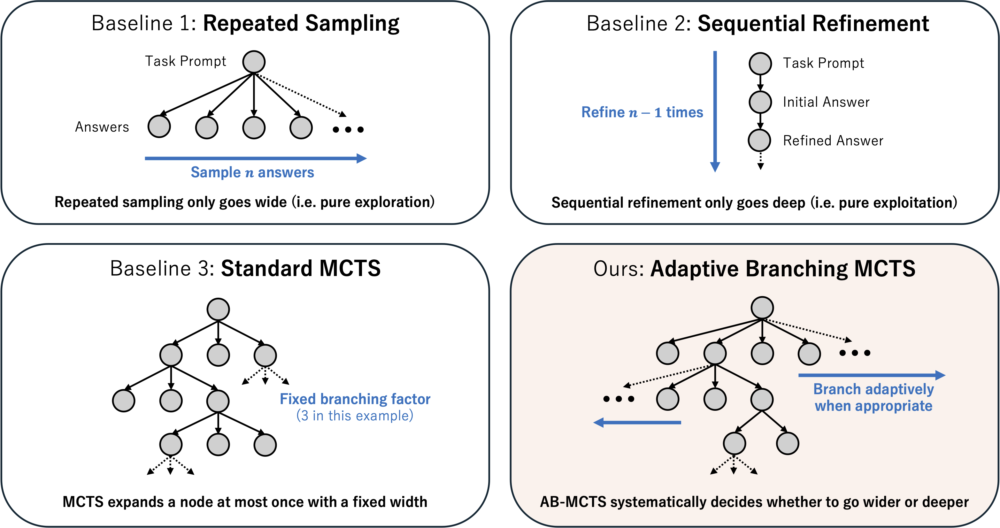

# TreeQuest
[](https://www.python.org)
[](https://www.apache.org/licenses/LICENSE-2.0)
[](https://github.com/SakanaAI/treequest/actions)
[](https://github.com/SakanaAI/treequest/actions)

[![arXiv](https://img.shields.io/badge/arXiv-2503.04412-B31B1B?logo=data:image/svg+xml;base64,PHN2ZyBpZD0ibG9nb21hcmsiIHhtbG5zPSJodHRwOi8vd3d3LnczLm9yZy8yMDAwL3N2ZyIgdmlld0JveD0iMCAwIDE3LjczMiAyNC4yNjkiPjxnIGlkPSJ0aW55Ij48cGF0aCBkPSJNNTczLjU0OSwyODAuOTE2bDIuMjY2LDIuNzM4LDYuNjc0LTcuODRjLjM1My0uNDcuNTItLjcxNy4zNTMtMS4xMTdhMS4yMTgsMS4yMTgsMCwwLDAtMS4wNjEtLjc0OGgwYS45NTMuOTUzLDAsMCwwLS43MTIuMjYyWiIgdHJhbnNmb3JtPSJ0cmFuc2xhdGUoLTU2Ni45ODQgLTI3MS41NDgpIiBmaWxsPSIjYmRiOWI0Ii8+PHBhdGggZD0iTTU3OS41MjUsMjgyLjIyNWwtMTAuNjA2LTEwLjE3NGExLjQxMywxLjQxMywwLDAsMC0uODM0LS41LDEuMDksMS4wOSwwLDAsMC0xLjAyNy42NmMtLjE2Ny40LS4wNDcuNjgxLjMxOSwxLjIwNmw4LjQ0LDEwLjI0MmgwbC02LjI4Miw3LjcxNmExLjMzNiwxLjMzNiwwLDAsMC0uMzIzLDEuMywxLjExNCwxLjExNCwwLDAsMCwxLjA0LjY5QS45OTIuOTkyLDAsMCwwLDU3MSwyOTNsOC41MTktNy45MkExLjkyNCwxLjkyNCwwLDAsMCw1NzkuNTI1LDI4Mi4yMjVaIiB0cmFuc2Zvcm09InRyYW5zbGF0ZSgtNTY2Ljk4NCAtMjcxLjU0OCkiIGZpbGw9IiNiMzFiMWIiLz48cGF0aCBkPSJNNTg0LjMyLDI5My45MTJsLTguNTI1LTEwLjI3NSwwLDBMNTczLjUzLDI4MC45bC0xLjM4OSwxLjI1NGEyLjA2MywyLjA2MywwLDAsMCwwLDIuOTY1bDEwLjgxMiwxMC40MTlhLjkyNS45MjUsMCwwLDAsLjc0Mi4yODIsMS4wMzksMS4wMzksMCwwLDAsLjk1My0uNjY3QTEuMjYxLDEuMjYxLDAsMCwwLDU4NC4zMiwyOTMuOTEyWiIgdHJhbnNmb3JtPSJ0cmFuc2xhdGUoLTU2Ni45ODQgLTI3MS41NDgpIiBmaWxsPSIjYmRiOWI0Ii8+PC9nPjwvc3ZnPg==)](https://arxiv.org/abs/2503.04412)
[![Blog](https://img.shields.io/badge/Blog-Sakana%20AI-blue?logo=data:image/png;base64,iVBORw0KGgoAAAANSUhEUgAAADAAAAAwCAYAAABXAvmHAAAFXElEQVRoge2XW4yV1RXHf+s751v7zDlnwAnMKNgRCOUmBi/BYipNG2MTrKaRanyxqdUH+sCTb5poYrz0og8afWjqQ9OkCbZAkza0pU0sA0RroiZ4GQtmZphvf+coUGC4zIU5l+9bfZghJQPMnDnDmCY9v8dvr732+q9v77XXhhYtWrRo0aJFi/9fZD6dG2SPQqFYIJckuBpkAyMwsERIMgHV0QyV3DCjy6EiYLNd45oLMMgcVW7OBtwRpKxLYSWwFOhEKABqkIoxanAW4YSkRAR8jtCbZuhdPsqJRsVcMwG9oAuU+0zYjrEO6ADyF9cQOGcwBIwahCIsFKPTIDPpoopwHuOMwadBwJ7ucXYIVOdNgIHEcF3i2JwxngXuNKgJnBLwQE8iHKTCR8u5PKvHoTCaZ10m4S4x7gXWAx0CCw2yCE8uq/DavAj4EMJOxxYznhDYAgQI7xrsDVL2S43ebrjQqD8DKeVZYnW+CfwUWCWw9aYqf2w2xqtSdqyOHLu8ctorqVfMK/88WuB6g2AuvmPHSq986ZULR6B9JvuGFzMIjha4PgrZnsB+MR5GqItwEBgGlgVVbhRI5yKAiW20BOHA2gm/09KQgCPQXsrxo0ydXSK8gZEX2IHwqDh+gPAJsEgCNtvcz9UDAAJ7GrHPzmRQCvmGwcuWcgfQjvAZ8FRbhQOdMMw4lBx/SuFuMW49Bm3AWDPB94ET2GowXDMOzlnAgGNVauwEugXKwCtJhVdWwPildkmGt6UOqbByrEiRkeYEOGWrGYsRevIhx6cvoA0IcMpQWmW3pWRS+O37NT5+BJKpdjbGYZSaGF1tCa6Z4I9AuwnbMOoYB24Y4Uwj86YV8LVhTpfg2QRsatYvZQWMR8KQQKFmM2/LK9Hm+A7GbcDJxNgrUG9k3oyHuBsuXBq8QWYQciVoM9DnJn00uuCVGICFGD8EOgz+saLGB43ObShb/UW6tMbtkrImEm4MhAUpZD2MP26c/nFATMoCgy/CYPZCQuV7BvchHEvg+dk0ddOWvMEcyzPGdjMeZKK3aQd0ipkxcePmBYZSeHVkIa/dcpKRRgLod3w9hHcwFoux7aYav240+GkFlJVH6sIbYnQBI8ApjH6EQwhlJtrfvMEaM7YILJsUIwhejKdzVfZ0cXUhcZ6lVmc3sCmAPxSrbOuAs7MRcNUtlAj3yMSB/D3wZwt4d9k4fupNaxBEyg5gqQh7MRzGvQZvjik7jwW8sGSc6LIEwaKkzs+AjcCRNMsvOqqzC35avoTFJceqPlgwnZ1XbvZK5B3H4xzfKsMiH/KYdxzzShIp7w0qa6eIznlll1cqXjlTDrlrrjd4UxhkY+WZSKnGjr8bhJPfpZTj25FyeLLR+0uUZ4lBUHas9o59Xkm9o1TOcc9XHvhFSsqGSPncK6MDOTZPHR8I2eiVQ7FSjx2/LCmPxsqHk3/msHc80NNgJbzmlKDNOw56JY2VF6/WRpdCNsWO2CuVSDnnFYsdPQOO1Tv/+xprmmbUS3+RzqTKrwLjbhP2acjrUr38cJ8osrha4XabKL0qwlkx3hyr8HwjrfK84JX1XtkdKdVI+bjUxqapB/DfUBzM8Vjs2D/54DkXKW95x3d7L79HvhoMst7xk0iJYqUeKR994VgzNfg4ZKMP2Rcp571i3vGv2PH9marZvDOorPVKX6Scj5S3+ot0XRwzCKIcK3yOn3tl1CtJrMSDynOliffBvNFw7e0DFyoPGVha4K8rz3Du4ljkuD8wXjLYAAyZ8Lsg5TfdNQ7JFdrv/zki5QWv1L3jb3HInfOd9WtOD2TLBW7to7nHTIsWLVq0aNEs/wHPLhDZrKccngAAAABJRU5ErkJggg==)](https://sakana.ai/ab-mcts/)



A flexible answer tree search library featuring **AB-MCTS**, useful for (but not limited to) LLM inference-time scaling.

## Quick Start
```python
import random

import treequest as tq

# Each node is associated with a user-definable `state`.
State = str

# 1. Define a function to be used for node generation.
def generate(parent_state: State | None) -> tuple[State, float]:
    """Generates new states and scores based on the parent state."""
    if parent_state is None: # None represents the expansion from root.
        new_state = "Initial state"
    else:
        new_state = f"State after {parent_state}"

    score = random.random() # A score for the new state; It should be normalized to the [0, 1] range.
    return new_state, score

# 2. Instantiate the algorithm and a search tree object.
algo = tq.ABMCTSA()
search_tree = algo.init_tree()

# 3. Run the search with a generation budget (10 in this case).
for _ in range(10):
    search_tree = algo.step(search_tree, {'Action A': generate})

# 4. Extract the best score and state.
best_state, best_node_score = tq.top_k(search_tree, algo, k=1)[0]
print(f"Best state: {best_state}, Score: {best_node_score}")
```

## Features
- Easy-to-use API with customizable node generation and node scoring logic.
- **AB-MCTS-A** and **AB-MCTS-M**, as well as **Multi-LLM AB-MCTS** support (See [our paper](https://arxiv.org/abs/2503.04412) for algorithm details).
- Checkpointing and resuming searches.

## Installation
### uv
First, install [`uv`](https://github.com/astral-sh/uv?tab=readme-ov-file#installation). Then you can install TreeQuest with the following command:
```bash
uv add "treequest[abmcts-m]" "https://github.com/SakanaAI/treequest.git@main"
```

### pip
Alternatively, you can use pip to install TreeQuest:
```bash
pip install "treequest[abmcts-m] @ git+https://github.com/SakanaAI/treequest.git"
```

## Usage
### Using an LLM as a Node Generator
You can use any object as a node state. You only need to define a generating function that returns a `(state, score)` tuple and takes the parent state as an argument:
```python
import dataclasses

import treequest as tq

@dataclasses.dataclass
class State:
    llm_answer: str
    score: float

def generate(parent_state: State | None) -> tuple[State, float]:
    """Generate a new node by calling an LLM."""
    if parent_state is None:
        state = initial_generation()
    else:
        state = refine_answer(parent_state.llm_answer, parent_state.score)

    return state, state.score
    
def initial_generation() -> State:
    """
    Call LLM API to generate an initial answer.
    """
    ...

def refine_answer(llm_answer: str, score: float) -> State:
    """
    Call LLM API to refine an answer.
    """
    ...


algo = tq.ABMCTSM()
search_tree = algo.init_tree()
for i in range(20):
    search_tree = algo.step(search_tree, {'Action Label': generate})
    # Logging best node during the search.
    if (i + 1) % 5 == 0:
        best_interim_state, _ = tq.top_k(search_tree, algo, k=1)[0]
        print(f"Iteration {i+1}: Best state so far = {best_interim_state}")

best_state, _ = tq.top_k(search_tree, algo, k=1)[0]
print(f"Best Answer: {best_state.llm_answer}, Best Score: {best_state.score}")
```

### Using Multiple LLMs (and Beyond)

TreeQuest supports multiple action types. For example, you can provide multiple generation functions backed by different LLMs to represent different action types:

```python
from functools import partial

import treequest as tq

def generate(llm_name: str, parent_state=None):
    """
    Call LLM API using litellm, vllm, etc., to generate a new node
    """
    ...
    return new_state, new_score

llm_names = ["o4-mini", "gemini-2.5-pro"]
# Create dict of different actions backed by different LLMs.
generate_fns = {llm_name: partial(generate, llm_name=llm_name) for llm_name in llm_names}

algo = tq.StandardMCTS()
search_tree = algo.init_tree()
for _ in range(20):
    search_tree = algo.step(search_tree, generate_fns)
```
The variation is not limited to LLM types; you can use different prompts, actions, scoring logic, etc. in `generate_fns`.

## Algorithms

### ABMCTS-A: ABMCTS with Node Aggregation

ABMCTS-A uses node aggregation for adaptive branching:

```python
import treequest as tq

# Instantiate the ABMCTS-A algorithm.
ab_mcts_a = tq.ABMCTSA()

search_tree = ab_mcts_a.init_tree()
for _ in range(50):
    search_tree = ab_mcts_a.step(search_tree, generate_fns)
```

### ABMCTS-M: ABMCTS with Mixed Models

ABMCTS-M leverages PyMC's mixed modeling capabilities:

```python
import treequest as tq

# Instantiate the ABMCTS-M algorithm.
ab_mcts_m = tq.ABMCTSM()

search_tree = ab_mcts_m.init_tree()
for _ in range(30):
    search_tree = ab_mcts_m.step(search_tree, generate_fns)
```

**NOTE**: To run AB-MCTS-M, you need to install extra dependencies with the `treequest[abmcts-m]` option.

## Requirements

- Python 3.11+

## Contributing

Contributions are welcome! Please see [CONTRIBUTING.md](./CONTRIBUTING.md) for development tips.

## Citation
```bibtex
@article{inoue2025wider,
  title={Wider or Deeper? Scaling LLM Inference-Time Compute with Adaptive Branching Tree Search},
  author={Inoue, Yuichi and Misaki, Kou and Imajuku, Yuki and Kuroki, So and Nakamura, Taishi and Akiba, Takuya},
  journal={arXiv preprint arXiv:2503.04412},
  year={2025}
}
```

## License

[Apache 2.0](./LICENSE)
